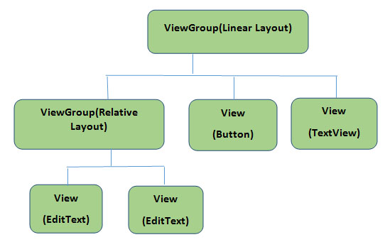
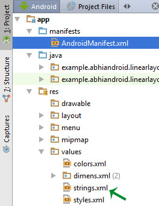

---

title: XML Extensible Markup Language. 

author : by  Shyed Shahriar Housaini.

linkcolor: blue

pdf-engine: xelatex

header-includes:
 - \usepackage[margin=.5in]{geometry}
 
classoption: "12pt"

---

# XML
> ## **_XML  :_**

 XML stands for Extensible Markup Language. XML is a markup language much like HTML used to describe data.  XML tags are not predefined in XML. We must define our own Tags. Xml as itself is well readable both by human and machine. Also, it is scalable and simple to develop. In Android we use xml for designing our layouts because xml is lightweight language so it doesn’t make our layout heavy.

.............

..................

............................

........................................

.....................................................

# XML in Android:
>  ## **_XML in Android:_**

### Basics

># **_Basics And Different XML Files Used In Android_**


In this article we will go through the basic concepts of xml in Android and different XML files used for different purpose in Android. This will help you in writing a UI code to design your desired user interface. 


>## **_Basics Of User Interface:_**


The whole concept of Android User Interface is defined using the hierarchy of View and ViewGroup objects. A ViewGroup is an invisible container that organizes child views. These child views are other widgets which are used to make the different parts of UI. One ViewGroup can have another ViewGroup as an child element as shown in the figure given below:

<!-- Images -->



<!--
+ Image credit to  [Basics Of User Interface](https://abhiandroid.com/ui/wp-content/uploads/2016/06/Basic-UI-user-interface-ViewGroup-and-View-Diagram.jpg).
-->
Here in above Diagram ViewGroup (Linear Layout) contains one ViewGroup (i.e. Relative Layout)and two View(Button and TextView). Further two more View (i.e. 2 EditText ) are nested inside Relative Layout ViewGroup. It is important to note that one layout can be nested in another layout.

The below code snippet will explain the above image in better way. Paste it in activity_main.xml

```xml
<?xml version="1.0" encoding="utf-8"?>
<LinearLayout xmlns:android="http://schemas.android.com/apk/res/android"
 android:orientation="vertical" android:layout_width="match_parent"
 android:layout_height="match_parent">


 <Button
 android:id="@+id/buton1"
 android:layout_width="wrap_content"
 android:layout_height="wrap_content"
 android:text="Button"/>

 <TextView
 android:id="@+id/textView1"
 android:layout_width="wrap_content"
 android:layout_height="wrap_content"
 android:text="sample Text"
 android:layout_marginTop="15dp"
 android:textSize="30dp"/>

 <RelativeLayout
 android:layout_width="match_parent"
 android:layout_height="match_parent">

 <EditText
 android:id="@+id/editTextName"
 android:layout_width="wrap_content"
 android:layout_height="wrap_content"
 android:hint="First Name"
 />

 <EditText
 android:id="@+id/editTextLastName"
 android:layout_width="wrap_content"
 android:layout_height="wrap_content"
 android:hint="Last Name"/>

 </RelativeLayout>
</LinearLayout>
```


# Different XML Files Used in Android:

> ## **_Different XML Files Used in Android:_**

In Android there are several xml files used for several different purposes. Below we define each and every one.

## 1. Layout XML Files:

 Layout xml files are used to define the actual UI(User interface) of our application. It holds all the elements(views) or the tools that we want to use in our application. Like the TextView’s, Button’s and other UI elements.

 ### Location in Android Studio:
You will find out this file inside the res folder and inside it there is another folder named layout where you will get all the layout files for their respective activities or fragments.


### Basic Layout XML Code:
Below we show activity_main.xml file in which we have two TextView’s.

``` xml

<!--  RelativeLayout in which we set green color for the background -->
<RelativeLayout xmlns:android="http://schemas.android.com/apk/res/android"
xmlns:tools="http://schemas.android.com/tools"
android:layout_width="match_parent"
android:layout_height="match_parent"
android:background="@color/greenColor"
tools:context=".MainActivity">

<TextView
android:id="@+id/firstTextView"
android:layout_width="wrap_content"
android:layout_height="wrap_content"
android:layout_centerHorizontal="true"
android:layout_margin="20dp"
android:padding="10dp"
android:text="First Text View"
android:textColor="@color/white"
android:textSize="20sp"
android:textStyle="bold" />
<!-- second TextView -->
<TextView
android:id="@+id/secondTextView"
android:layout_width="wrap_content"
android:layout_height="wrap_content"
android:layout_below="@+id/firstTextView"
android:layout_centerHorizontal="true"
android:layout_margin="20dp"
android:padding="10dp"
android:text="Second Text View"
android:textColor="@color/white"
android:textSize="20sp"
android:textStyle="bold" />

</RelativeLayout>

``` 

## 2. Manifest xml File (Mainfest.xml):

 This xml is used to define all the components of our application. It includes the names of our application packages, our Activities, receivers, services  and the permissions that our application needs. For Example – Suppose we need to use internet in our app then we need to define Internet permission in this file.

####  Location in Android Studio:

It is located inside app > manifests folder 


### Defining Internet Permission in AndroidManifest.xml

Below we show the AndroidManifest.xml file and define the Internet Permission in that file.

```XML

<?xml version="1.0" encoding="utf-8"?>
<manifest xmlns:android="http://schemas.android.com/apk/res/android"
package="example.abhiandroid.MyApplication">     <!-- application package name -->

<uses-permission android:name="ANDROID.PERMISSION.INTERNET" />
<!-- define Internet Permission -->
<application
android:allowBackup="true"
android:icon="@mipmap/ic_launcher"
android:label="@string/app_name"
android:theme="@style/AppTheme">

<!-- add your Activities, Receivers, Services Names Here -->
<activity
android:name=".MainActivity"
android:label="@string/app_name">
<intent-filter>
<action android:name="android.intent.action.MAIN" />

<category android:name="android.intent.category.LAUNCHER" />
</intent-filter>
</activity>
</application>

</manifest>

```

  ## 3. Strings xml File(strings.xml):
 This xml file is used to replace the Hard-coded strings with a single string. We define all the strings in this xml file and then access them in our app(Activity or in  Layout XML files) from this file. This file enhance the reusability of the code.

### Location in Android Studio:




> Below we show strings.xml file and define a string in the file.

```xml
<resources>
<string name="app_name">My Application</string>

<string name="hello_world">Hello world!</string>
<string name="action_settings">Settings</string>
<string name="login">User Login</string>
<!-- define your strings here -->
</resources>

```

## 4. Styles xml File(styles.xml): 
This xml is used to define different styles and looks for the UI(User Interface) of application. We define our custom themes and styles in this file.

### Location in Android Studio:


> Below we show the style.xml file.

```xml
<resources>
<!-- Base application theme. -->
<style name="AppTheme" parent="Theme.AppCompat.Light.DarkActionBar">
<!-- Customize your theme here. -->
</style>

</resources>

```
## 5. Drawable xml Files: 
These are those xml files that are used to provide various graphics to the elements or views of application. When we need to create a custom UI we use drawable xml files. Suppose if we need to define a gradient color in the background of Button or any custom shape for a view then we create a Drawable xml file and set it in the background of View.

>>> Do Read: How To Create Drawable Resource XML File in Android Studio 

> Below we show custom_drawable.xml file and create a gradient background color using style attribute.

```xml
<?xml version="1.0" encoding="utf-8"?>
<shape xmlns:android="http://schemas.android.com/apk/res/android">
<!-- define start, center and end color for gradient -->
<gradient
android:centerColor="#0f0"
android:endColor="#00f"
android:startColor="#f00" />
</shape>
```

## 6. Color xml File (colors.xml):
 This file is used to define the color codes that we used in our app. We simply define the color’s in this file and used them in our app from this file.

### Location in Android Studio


> Below we show the colors.xml file in which we define green and white color.

```xml
<?xml version="1.0" encoding="utf-8"?>
<resources>
<!-- define your colors Here -->
<color name="greenColor">#0f0</color>
<color name="white">#fff</color>
</resources>
```
## 7. Dimension xml File(dimens.xml):
 This xml file is used to define the dimensions of the View’s. Suppose we need a Button with 50dp(density pixel) height then we define the value 50dp in dimens.xml file and then use it in our app from this file.

### Location in Android Studio:


> Below we show the dimens.xml file in which we define 50dp  dimension for Button height.

```xml
<resources>
<!-- Default screen margins, per the Android Design guidelines. -->
<dimen name="activity_horizontal_margin">16dp</dimen>
<dimen name="activity_vertical_margin">16dp</dimen><dimen name="btnheight">50dp</dimen>
</resources>
```

# HOME [digitalbd.org](https://digitalbd.org) 

# Contact

+ Email    : [shyed2001@gmail.com](mailto:shyed2001@gmail.com)

+ Website  : [https://digitalbd.org](https://digitalbd.org)

+ Github   : [https://github.com/shyed2001](https://github.com/shyed2001)

+ LinkedIn : [https://www.linkedin.com/in/shyed-shahriar-housaini](https://www.linkedin.com/in/shyed-shahriar-housaini) 

+ MyCV     : [https://digitalbd.org/MyCV.html](https://digitalbd.org/MyCV.html)
