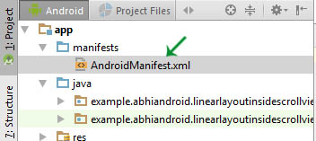
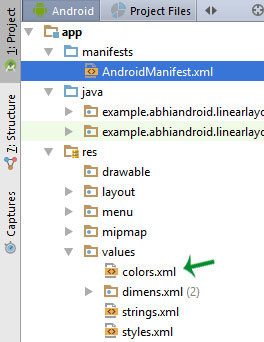

---

title: XML Extensible Markup Language এক্সএমএল_ এক্সটেনসিবল মার্কআপ ল্যাঙ্গুয়েজ এবং অ্যান্ড্রয়েডে এক্সএমএল . 

author : by  Shyed Shahriar Housaini.

linkcolor: blue

pdf-engine: xelatex

header-includes:
 - \usepackage[margin=.5in]{geometry}
 
classoption: "12pt"

---

# XML
> ## **_XML  :_**

 XML stands for Extensible Markup Language. XML is a markup language much like HTML used to describe data.  XML tags are not predefined in XML. We must define our own Tags. Xml as itself is well readable both by human and machine. Also, it is scalable and simple to develop. In Android we use xml for designing our layouts because xml is lightweight language so it doesn’t make our layout heavy.

.............

..................

............................

........................................

.....................................................

# XML in Android:
>  ## **_XML in Android:_**

### Basics

># **_Basics And Different XML Files Used In Android_**


In this article we will go through the basic concepts of xml in Android and different XML files used for different purpose in Android. This will help you in writing a UI code to design your desired user interface. 


>## **_Basics Of User Interface:_**


The whole concept of Android User Interface is defined using the hierarchy of View and ViewGroup objects. A ViewGroup is an invisible container that organizes child views. These child views are other widgets which are used to make the different parts of UI. One ViewGroup can have another ViewGroup as an child element as shown in the figure given below:

# এক্সএমএল
> ## ** _ এক্সএমএল: _ **

 এক্সএমএল মানে এক্সটেনসিবল মার্কআপ ল্যাঙ্গুয়েজ। এক্সএমএল হ'ল এইচটিএমএলের মতো ডেটা বর্ণনার জন্য ব্যবহৃত একটি মার্কআপ ভাষা। এক্সএমএল ট্যাগগুলি এক্সএমএলে পূর্বনির্ধারিত নয়। আমাদের অবশ্যই নিজের ট্যাগ সংজ্ঞায়িত করতে হবে। এক্সএমএল নিজে এবং মানুষ এবং মেশিন উভয়ই ভালভাবে পঠনযোগ্য। এছাড়াও এটি বিকাশযোগ্য এবং সহজ is অ্যান্ড্রয়েডে আমরা আমাদের লেআউটগুলি ডিজাইনের জন্য এক্সএমএল ব্যবহার করি কারণ এক্সএমএল হালকা ওজনের ভাষা তাই এটি আমাদের লেআউটটিকে ভারী করে না।

.............

..................

............................

........................................

.................................................. ...

অ্যান্ড্রয়েডে # এক্সএমএল:
> ## ** _ অ্যান্ড্রয়েডে এক্সএমএল: _ **

### মূল কথা

> # ** _ অ্যান্ড্রয়েডে ব্যবহৃত বেসিক এবং বিভিন্ন এক্সএমএল ফাইল _ **


এই নিবন্ধে আমরা অ্যান্ড্রয়েডে এক্সএমএল এবং অ্যান্ড্রয়েডে বিভিন্ন উদ্দেশ্যে ব্যবহৃত বিভিন্ন এক্সএমএল ফাইলের প্রাথমিক ধারণাগুলি নিয়ে যাব। এটি আপনাকে আপনার পছন্দসই ইউজার ইন্টারফেসটি ডিজাইন করতে একটি ইউআই কোড রচনায় সহায়তা করবে।


<!-- Images -->


<!--
+ Image credit to  [Basics Of User Interface](https://abhiandroid.com/ui/wp-content/uploads/2016/06/Basic-UI-user-interface-ViewGroup-and-View-Diagram.jpg).
-->

Here in above Diagram ViewGroup (Linear Layout) contains one ViewGroup (i.e. Relative Layout)and two View(Button and TextView). Further two more View (i.e. 2 EditText ) are nested inside Relative Layout ViewGroup. It is important to note that one layout can be nested in another layout.

উপরের চিত্রগুলিতে ভিউগ্রুপ (লিনিয়ার লেআউট) এর মধ্যে একটি ভিউ গ্রুপ (অর্থাত্ রিলেটিভ লেআউট) এবং দুটি ভিউ (বাটন এবং টেক্সটভিউ) রয়েছে। আরও দুটি ভিউ (অর্থাত্ 2 এডিটেক্সট) রিলেটিভ লেআউট ভিউগ্রুপের ভিতরে বাসাযুক্ত। এটি লক্ষ করা গুরুত্বপূর্ণ যে একটি বিন্যাস অন্য লেআউটে নেস্ট করা যায়।

নীচের কোড স্নিপেট উপরের চিত্রটি আরও ভালভাবে ব্যাখ্যা করবে। এটিকে কার্যকলাপ_মাইন.এক্সএম এ আটকান

The below code snippet will explain the above image in better way. Paste it in activity_main.xm

```xml
<?xml version="1.0" encoding="utf-8"?>
<LinearLayout xmlns:android="http://schemas.android.com/apk/res/android"
 android:orientation="vertical" android:layout_width="match_parent"
 android:layout_height="match_parent">


 <Button
 android:id="@+id/buton1"
 android:layout_width="wrap_content"
 android:layout_height="wrap_content"
 android:text="Button"/>

 <TextView
 android:id="@+id/textView1"
 android:layout_width="wrap_content"
 android:layout_height="wrap_content"
 android:text="sample Text"
 android:layout_marginTop="15dp"
 android:textSize="30dp"/>

 <RelativeLayout
 android:layout_width="match_parent"
 android:layout_height="match_parent">

 <EditText
 android:id="@+id/editTextName"
 android:layout_width="wrap_content"
 android:layout_height="wrap_content"
 android:hint="First Name"
 />

 <EditText
 android:id="@+id/editTextLastName"
 android:layout_width="wrap_content"
 android:layout_height="wrap_content"
 android:hint="Last Name"/>

 </RelativeLayout>
</LinearLayout>
```


# Different XML Files Used in Android:

> ## **_Different XML Files Used in Android:_**

In Android there are several xml files used for several different purposes. Below we define each and every one.

## 1. Layout XML Files:

 Layout xml files are used to define the actual UI(User interface) of our application. It holds all the elements(views) or the tools that we want to use in our application. Like the TextView’s, Button’s and other UI elements.

 ### Location in Android Studio:
You will find out this file inside the res folder and inside it there is another folder named layout where you will get all the layout files for their respective activities or fragments.


## 1. লেআউট এক্সএমএল ফাইলগুলি:

  লেআউট এক্সএমএল ফাইলগুলি আমাদের অ্যাপ্লিকেশনটির প্রকৃত ইউআই (ইউজার ইন্টারফেস) সংজ্ঞায়িত করতে ব্যবহৃত হয়। এটি আমাদের অ্যাপ্লিকেশনটিতে সমস্ত উপাদান (দর্শন) বা সরঞ্জামগুলি ব্যবহার করতে চাই যা এটি ধারণ করে। টেক্সটভিউ, বোতাম এবং অন্যান্য ইউআই উপাদানগুলির মতো।

  ### অ্যান্ড্রয়েড স্টুডিওতে অবস্থান:
আপনি এই ফাইলটি রেজোল্ড ফোল্ডারের ভিতরে খুঁজে পাবেন এবং এর ভিতরে অন্য একটি ফোল্ডার রয়েছে যার নাম লেআউট রয়েছে যেখানে আপনি তাদের নিজ নিজ ক্রিয়াকলাপ বা টুকরো জন্য সমস্ত লেআউট ফাইল পাবেন।

### Basic Layout XML Code:
Below we show activity_main.xml file in which we have two TextView’s.
### বেসিক লেআউট এক্সএমএল কোড:
নীচে আমরা ক্রিয়াকলাপ_মাইন.এক্সএমএল ফাইলটি প্রদর্শন করি যেখানে আমাদের দুটি পাঠ্যদর্শন রয়েছে।
``` xml

<!--  RelativeLayout in which we set green color for the background -->
<RelativeLayout xmlns:android="http://schemas.android.com/apk/res/android"
xmlns:tools="http://schemas.android.com/tools"
android:layout_width="match_parent"
android:layout_height="match_parent"
android:background="@color/greenColor"
tools:context=".MainActivity">

<TextView
android:id="@+id/firstTextView"
android:layout_width="wrap_content"
android:layout_height="wrap_content"
android:layout_centerHorizontal="true"
android:layout_margin="20dp"
android:padding="10dp"
android:text="First Text View"
android:textColor="@color/white"
android:textSize="20sp"
android:textStyle="bold" />
<!-- second TextView -->
<TextView
android:id="@+id/secondTextView"
android:layout_width="wrap_content"
android:layout_height="wrap_content"
android:layout_below="@+id/firstTextView"
android:layout_centerHorizontal="true"
android:layout_margin="20dp"
android:padding="10dp"
android:text="Second Text View"
android:textColor="@color/white"
android:textSize="20sp"
android:textStyle="bold" />

</RelativeLayout>

``` 

## 2. Manifest xml File (Mainfest.xml):

 This xml is used to define all the components of our application. It includes the names of our application packages, our Activities, receivers, services  and the permissions that our application needs. For Example – Suppose we need to use internet in our app then we need to define Internet permission in this file.

## 2. ম্যানিফেস্ট এক্সএমএল ফাইল (মেইনফেস্ট.এক্সএমএল):

  এই এক্সএমএলটি আমাদের অ্যাপ্লিকেশনটির সমস্ত উপাদান সংজ্ঞায়িত করতে ব্যবহৃত হয়। এটিতে আমাদের অ্যাপ্লিকেশনগুলির প্রয়োজনীয় প্যাকেজগুলির নাম, আমাদের ক্রিয়াকলাপ, রিসিভার, পরিষেবা এবং আমাদের অ্যাপ্লিকেশনটির প্রয়োজনীয় অনুমতি রয়েছে। উদাহরণস্বরূপ - ধরুন আমাদের অ্যাপ্লিকেশনটিতে আমাদের ইন্টারনেট ব্যবহার করা প্রয়োজন তবে আমাদের এই ফাইলে ইন্টারনেটের অনুমতি নির্ধারণ করতে হবে।

#### অ্যান্ড্রয়েড স্টুডিওতে অবস্থান:

এটি অ্যাপের ভিতরে অবস্থিত> ফোল্ডারটি প্রকাশ করে
####  Location in Android Studio:

It is located inside app > manifests folder 




### Defining Internet Permission in AndroidManifest.xml

Below we show the AndroidManifest.xml file and define the Internet Permission in that file.
### অ্যান্ড্রয়েড ম্যানিফেস্ট.এক্সএমএলে ইন্টারনেট অনুমতি নির্ধারণ করা

নীচে আমরা অ্যান্ড্রয়েড ম্যানিফেস্ট.এক্সএমএল ফাইলটি দেখাই এবং সেই ফাইলটিতে ইন্টারনেট অনুমতি সংজ্ঞায়িত করি।

```XML

<?xml version="1.0" encoding="utf-8"?>
<manifest xmlns:android="http://schemas.android.com/apk/res/android"
package="example.abhiandroid.MyApplication">     <!-- application package name -->

<uses-permission android:name="ANDROID.PERMISSION.INTERNET" />
<!-- define Internet Permission -->
<application
android:allowBackup="true"
android:icon="@mipmap/ic_launcher"
android:label="@string/app_name"
android:theme="@style/AppTheme">

<!-- add your Activities, Receivers, Services Names Here -->
<activity
android:name=".MainActivity"
android:label="@string/app_name">
<intent-filter>
<action android:name="android.intent.action.MAIN" />

<category android:name="android.intent.category.LAUNCHER" />
</intent-filter>
</activity>
</application>

</manifest>

```

  ## 3. Strings xml File(strings.xml):
 This xml file is used to replace the Hard-coded strings with a single string. We define all the strings in this xml file and then access them in our app(Activity or in  Layout XML files) from this file. This file enhance the reusability of the code.

### Location in Android Studio:

321 / 5000
Translation results
## 3. স্ট্রিংস এক্সএমএল ফাইল (স্ট্রিং.এক্সএমএল):
  এই এক্সএমএল ফাইলটি হার্ড-কোডেড স্ট্রিংগুলিকে একক স্ট্রিংয়ের সাথে প্রতিস্থাপন করতে ব্যবহৃত হয়। আমরা এই এক্সএমএল ফাইলে সমস্ত স্ট্রিং সংজ্ঞায়িত করেছি এবং তারপরে এই ফাইলটি থেকে আমাদের অ্যাপে (ক্রিয়াকলাপ বা লেআউট এক্সএমএল ফাইলগুলিতে) অ্যাক্সেস করব। এই ফাইলটি কোডের পুনঃব্যবহারযোগ্যতা বাড়ায়।

### অ্যান্ড্রয়েড স্টুডিওতে অবস্থান: 


> Below we show strings.xml file and define a string in the file.

65 / 5000
Translation results
> নীচে আমরা স্ট্রিং.এক্সএমএল ফাইল দেখি এবং ফাইলটিতে একটি স্ট্রিং সংজ্ঞায়িত করি। 

```xml
<resources>
<string name="app_name">My Application</string>

<string name="hello_world">Hello world!</string>
<string name="action_settings">Settings</string>
<string name="login">User Login</string>
<!-- define your strings here -->
</resources>

```

## 4. Styles xml File(styles.xml): 
This xml is used to define different styles and looks for the UI(User Interface) of application. We define our custom themes and styles in this file.

### Location in Android Studio:

## 4. স্টাইলস এক্সএমএল ফাইল (শৈলী। এক্সএমএল):
এই এক্সএমএলটি বিভিন্ন স্টাইল সংজ্ঞায়িত করতে ব্যবহৃত হয় এবং অ্যাপ্লিকেশনটির ইউআই (ইউজার ইন্টারফেস) সন্ধান করে। আমরা এই ফাইলটিতে আমাদের কাস্টম থিম এবং শৈলীর সংজ্ঞা দিই।

### অ্যান্ড্রয়েড স্টুডিওতে অবস্থান:


> Below we show the style.xml file.
> নীচে আমরা স্টাইল.এক্সএমএল ফাইলটি দেখাব।
```xml
<resources>
<!-- Base application theme. -->
<style name="AppTheme" parent="Theme.AppCompat.Light.DarkActionBar">
<!-- Customize your theme here. -->
</style>

</resources>

```
## 5. Drawable xml Files: 
These are those xml files that are used to provide various graphics to the elements or views of application. When we need to create a custom UI we use drawable xml files. Suppose if we need to define a gradient color in the background of Button or any custom shape for a view then we create a Drawable xml file and set it in the background of View.

>>> Do Read: How To Create Drawable Resource XML File in Android Studio 

> Below we show custom_drawable.xml file and create a gradient background color using style attribute.


## 5. অঙ্কনযোগ্য এক্সএমএল ফাইল:
এটি সেইগুলি এক্সএমএল ফাইল যা অ্যাপ্লিকেশনের উপাদানগুলি বা দর্শনের বিভিন্ন গ্রাফিক্স সরবরাহ করতে ব্যবহৃত হয়। যখন আমাদের একটি কাস্টম ইউআই তৈরি করা দরকার তখন আমরা অঙ্কনযোগ্য এক্সএমএল ফাইল ব্যবহার করি। মনে করুন আমাদের যদি দেখার জন্য বাটনের পটভূমিতে কোনও গ্রেডিয়েন্ট রঙ বা কোনও কাস্টম শেপ সংজ্ঞায়িত করতে হয় তবে আমরা একটি অঙ্কনযোগ্য এক্সএমএল ফাইল তৈরি করব এবং এটি ভিউ এর পটভূমিতে সেট করব।

>>> পড়ুন: অ্যান্ড্রয়েড স্টুডিওতে কীভাবে ড্রয়যোগ্য রিসোর্স এক্সএমএল ফাইল তৈরি করবেন

> নীচে আমরা কাস্টম_ড্রেবেবল.এক্সএমএল ফাইল দেখি এবং শৈলীর বৈশিষ্ট্য ব্যবহার করে গ্রেডিয়েন্ট পটভূমি রঙ তৈরি করি।

```xml
<?xml version="1.0" encoding="utf-8"?>
<shape xmlns:android="http://schemas.android.com/apk/res/android">
<!-- define start, center and end color for gradient -->
<gradient
android:centerColor="#0f0"
android:endColor="#00f"
android:startColor="#f00" />
</shape>
```

## 6. Color xml File (colors.xml):
 This file is used to define the color codes that we used in our app. We simply define the color’s in this file and used them in our app from this file.

### Location in Android Studio

## 6. রঙিন এক্সএমএল ফাইল (color.xML):
  এই ফাইলটি আমরা আমাদের অ্যাপ্লিকেশনটিতে যে রঙিন কোডগুলি ব্যবহার করেছি তা সংজ্ঞায়িত করতে ব্যবহৃত হয়। আমরা কেবল এই ফাইলটিতে রঙের সংজ্ঞা দিই এবং এই ফাইলটি থেকে আমাদের অ্যাপ্লিকেশনটিতে সেগুলি ব্যবহার করি।

### অ্যান্ড্রয়েড স্টুডিওতে অবস্থান



> Below we show the colors.xml file in which we define green and white color.

```xml
<?xml version="1.0" encoding="utf-8"?>
<resources>
<!-- define your colors Here -->
<color name="greenColor">#0f0</color>
<color name="white">#fff</color>
</resources>
```
## 7. Dimension xml File(dimens.xml):
 This xml file is used to define the dimensions of the View’s. Suppose we need a Button with 50dp(density pixel) height then we define the value 50dp in dimens.xml file and then use it in our app from this file.

### Location in Android Studio:

## 7. মাত্রা এক্সএমএল ফাইল (dimens.xML):
  এই এক্সএমএল ফাইলটি ভিউ'র মাত্রা নির্ধারণ করতে ব্যবহৃত হয়। মনে করুন আমাদের 50 ডিপি (ঘনত্বের পিক্সেল) উচ্চতার একটি বাটন প্রয়োজন তখন আমরা dimens.xML ফাইলে 50dp মানটি সংজ্ঞায়িত করি এবং তারপরে এই ফাইলটি থেকে আমাদের অ্যাপ্লিকেশনটিতে এটি ব্যবহার করি।

### অ্যান্ড্রয়েড স্টুডিওতে অবস্থান:


> Below we show the dimens.xml file in which we define 50dp  dimension for Button height.

> নীচে আমরা dimens.xML ফাইলটি দেখাই যেখানে আমরা বোতামের উচ্চতার জন্য 50dp মাত্রা নির্ধারণ করি।

```xml
<resources>
<!-- Default screen margins, per the Android Design guidelines. -->
<dimen name="activity_horizontal_margin">16dp</dimen>
<dimen name="activity_vertical_margin">16dp</dimen><dimen name="btnheight">50dp</dimen>
</resources>
```


# HOME [digitalbd.org](https://digitalbd.org) 

# Contact

+ Email    : [shyed2001@gmail.com](mailto:shyed2001@gmail.com)

+ Website  : [https://digitalbd.org](https://digitalbd.org)

+ Github   : [https://github.com/shyed2001](https://github.com/shyed2001)

+ LinkedIn : [https://www.linkedin.com/in/shyed-shahriar-housaini](https://www.linkedin.com/in/shyed-shahriar-housaini) 

+ MyCV     : [https://digitalbd.org/MyCV.html](https://digitalbd.org/MyCV.html)
